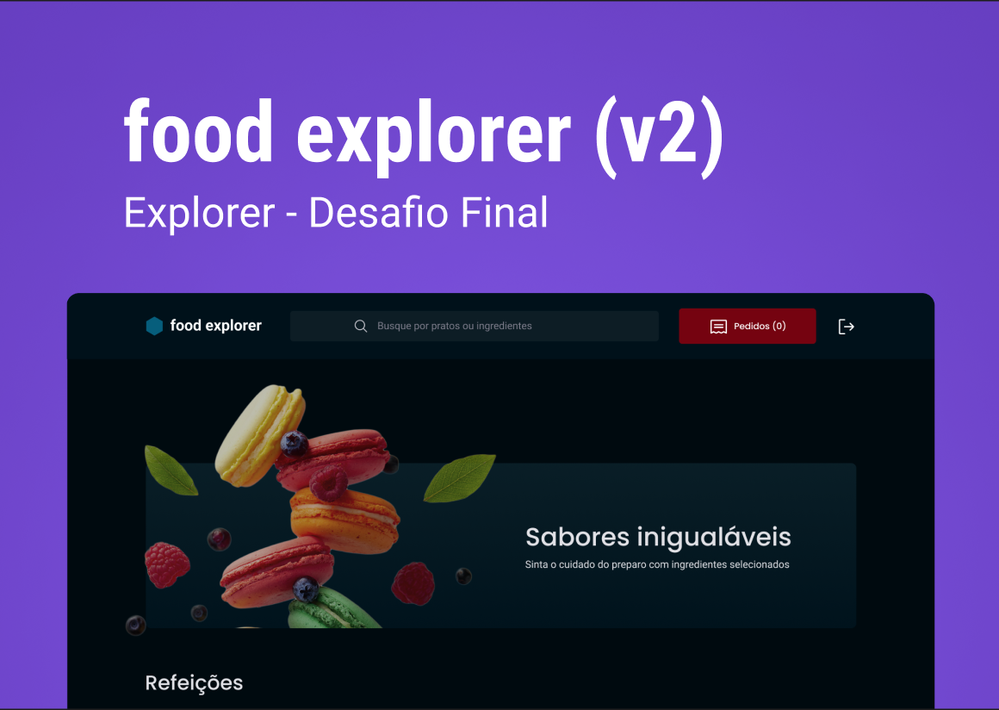

<p align="center">
  
</p>

<p align="center">
  <h1 align="center">Food Explorer - Rocketseat Explorer - Desafio Final</h1>
</p>

# Sobre o desafio

Nesse desafio implementamos o FOOD EXPLORER, um menu interativo para um restaurante fictício.

## 🚀 Tecnologias

Esse projeto foi desenvolvido com as seguintes tecnologias:

- HTML
- CSS
- ReactJS
- NodeJS
- Vite

## 🎨 Layout

Figma:

<a href="https://www.figma.com/file/GkqG5AUJe3ppcUEHfvOX6z/food-explorer?node-id=0%3A1">
  
</a>

## 🚀 Execuntando o projeto - FrontEnd

```bash

$ npm install
$ npm run dev

# Acesso
$ email: admin@admin.com
$ password: 456123

```

## 🚀 Execuntando o projeto - BackEnd

```bash

# No BackEnd insira uma porta e um secret no arquivo .env vazio
  AUTH_SECRET=
  PORT=

$ npm install
$ npm run dev

## 🚀 Deploy

<p align="center">
<a href="https://desafio-final-front-end.vercel.app/">https://desafio-final-front-end.vercel.app/</a>
</p>


